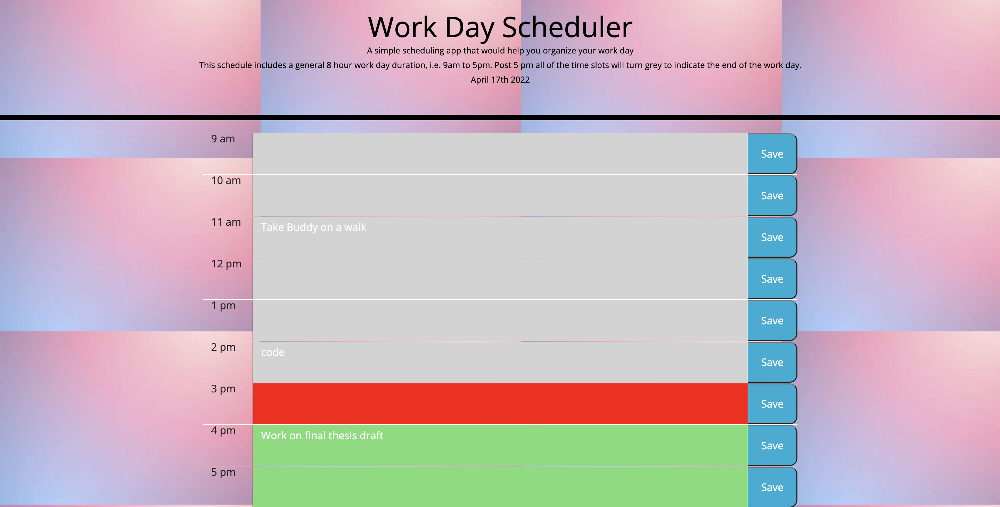

# Work-Day-Scheduler
Module 5 Weekly Challenge - Work Day Scheduler 

# User Story 
AS AN employee with a busy schedule
I WANT to add important events to a daily planner
SO THAT I can manage my time effectively

# Acceptance Criteria
- GIVEN I am using a daily planner to create a schedule
- WHEN I open the planner
- THEN the current day is displayed at the top of the calendar
- WHEN I scroll down
- THEN I am presented with time blocks for standard business hours
- WHEN I view the time blocks for that day
- THEN each time block is color-coded to indicate whether it is in the past, present, or
  future
- WHEN I click into a time block
- THEN I can enter an event
- WHEN I click the save button for that time block
- THEN the text for that event is saved in local storage
- WHEN I refresh the page
- THEN the saved events persist

# Mock-Up

# How to navigate through this Work Day Scheduler 

- This is a simple work day scheduler that goes through a general 8 hour working day, i.e. 9 am to 5 pm. As the day progresses by the hour, the time of the day will turn grey, red or green depending on whether its past, present or future respectively. Post 5 pm mark, the timeslots in the scheduler will turn grey indicating the end of a general work day. 

- To add or remove a task, simply type the task in the text area beside the desired hour and click save, and to remove/delete the task, delete the text and click save for the same. 

